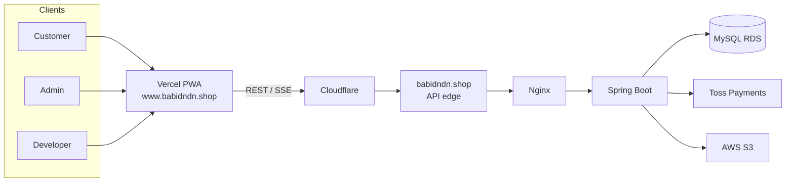

# BabiOrder

스마트한 매장 픽업 주문·결제·운영을 위한 웹 플랫폼 · 서비스명 **바비오더**

**바비든든** 매장의 고객 주문부터 결제, 매장 운영, Developer observability까지 하나의 모노레포로 관리합니다.


[Architecture](docs/ARCHITECTURE.md) · [Conventions](docs/CONVENTIONS.md) · [Current Context](docs/CURRENT_CONTEXT.md)

> Source of truth는 항상 실제 코드입니다.

---

## Overview

| Actor | 하는 일 |
|-------|---------|
| **Customer** (`/user`) | 메뉴 탐색 → 주문 → Toss 결제 → 주문 상태 확인 (PWA) |
| **Admin** (`/admin`) | 주문 접수·호출·완료 · 메뉴/결제/매출 운영 |
| **Developer** (`/dev`) | Analytics · 이벤트 · HTTP 요청 · 오류 · 결제 정합성 |

고객은 로그인 없이 이용합니다. Admin/Developer는 JWT(`ROLE_ADMIN` / `ROLE_DEVELOPER`)로 인증합니다.

---

## Key Features

| Customer | Admin | Developer |
|----------|-------|-----------|
| 메뉴·옵션·장바구니 | 실시간 주문 대시보드 (SSE) | Analytics Control Center |
| Toss 결제 | 고객 호출 · 상태 처리 | 사용자 행동 이벤트 |
| 주문 상태 폴링 · Web Push | 메뉴/옵션 CRUD · 매출 | HTTP 요청 / requestId 추적 |
| 최근 주문 · 나만의 메뉴 | 결제 내역 · 취소/환불 | FE/BE 오류 진단 |
| PWA 설치 | 팝업/리뷰 · S3 이미지 | 결제 정합성 (Toss 대조) |

---

## System Overview

Production FE(`www.babidndn.shop`)가 API를 호출하는 경로입니다.



- **FE:** Vercel — Cloudflare proxy 대상 아님
- **API (application):** `babidndn.shop` — production FE가 사용하는 API base
- dev/prod 상세 topology: [docs/ARCHITECTURE.md](docs/ARCHITECTURE.md)

---

## Tech Stack

| 영역 | 구성 |
|------|------|
| FE | React 19, TypeScript, Vite 8, Tailwind 4, React Router 7, PWA |
| BE | Java 21, Spring Boot 4, JPA, JWT, SSE |
| DB | MySQL 8, Flyway |
| Infra | Vercel, GitHub Actions → ECR → EC2 Docker, RDS |
| Payment | Toss Payments |

---

## Repository Structure

```text
babidndn/
├── FE/                 # React PWA (user / admin / dev)
├── BE/                 # Spring Boot API
├── .github/workflows/  # BE → ECR → EC2
├── vercel.json         # FE 빌드·API rewrite
└── docs/
```

---

## Local Development

**Prerequisites:** Java 21, Docker Compose, Node.js, npm

```bash
# Backend
cd BE && docker compose up -d
cp .env.example .env    # 값 수정
./gradlew bootRun

# Frontend
cd FE && npm install && npm run dev
```

| 변수 | 용도 |
|------|------|
| `VITE_API_BASE_URL` | 로컬 BE (`http://localhost:8080`) |
| `VITE_TOSS_CLIENT_KEY` | 결제 테스트 |

`VITE_API_BASE_URL` 미설정 시 Vite `/api` 프록시 사용 (`vite.config.ts`). Swagger: `/swagger-ui/index.html`

---

## Environments

| | FE | API (application) | DB |
|--|-----|-------------------|-----|
| **Prod** | `www.babidndn.shop` | `babidndn.shop` | `babi_order` |
| **Dev** | `dev.babidndn.shop` | `dev-api.babidndn.shop` | `babi_order_dev` |

BE: `main` → prod, `dev` → dev branch push 시 배포. FE: Vercel.
환경변수 이름: `BE/.env.example` (secret 값은 문서에 기록하지 않음)

---

## Tests

```bash
cd BE && ./gradlew test
cd FE && npm run lint && npm test && npm run build
```

배포·runtime 상태: [docs/CURRENT_CONTEXT.md](docs/CURRENT_CONTEXT.md)

---

## Documentation

| 문서 | 내용 |
|------|------|
| [ARCHITECTURE.md](docs/ARCHITECTURE.md) | FE/BE/DB/infra 구조, order/payment lifecycle, observability |
| [CONVENTIONS.md](docs/CONVENTIONS.md) | 구현 위치·책임·코딩 규칙 |
| [CURRENT_CONTEXT.md](docs/CURRENT_CONTEXT.md) | 현재 배포 상태, pending 작업 |

---

## Out of Scope

QR 코드 · WebSocket(Admin SSE 사용) · Android 프린터 앱 소스 · Fresh empty MySQL bootstrap

---

## License

저장소에 별도 LICENSE 파일 없음.
