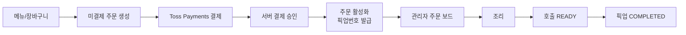
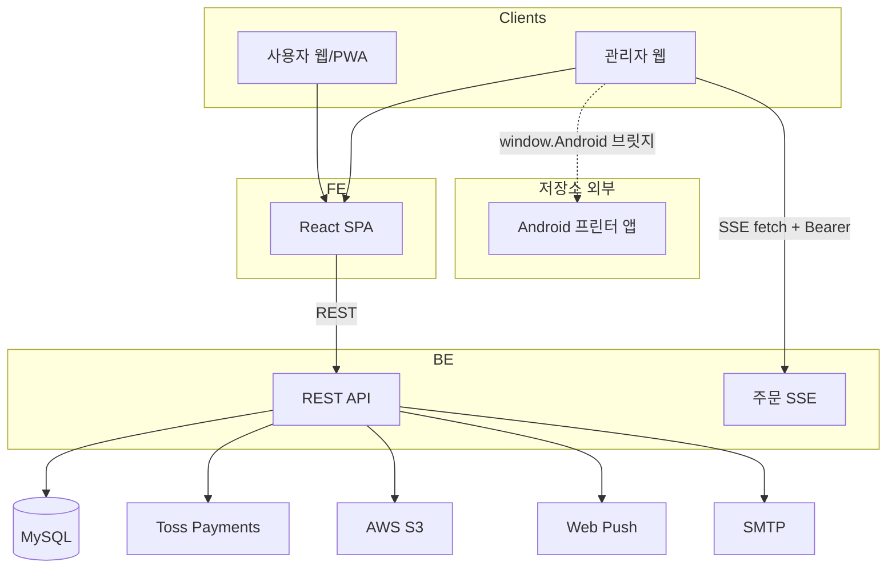
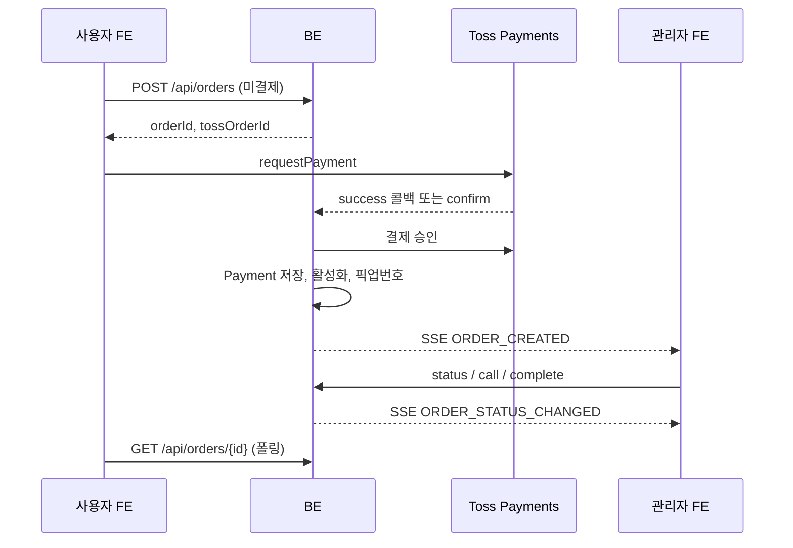

# BabiOrder

바비든든 매장을 위한 웹 주문·결제·매장 관리 서비스입니다.  
서비스 표시명: **바비오더**

이 저장소는 백엔드(`BE`)와 프론트엔드(`FE`) 모노레포입니다.

---

## 1. 프로젝트 소개

고객용 웹(PWA)과 관리자 웹으로 매장 주문 흐름을 연결합니다.

- **고객**: 메뉴 선택 → Toss Payments 결제 → 픽업번호·주문 상태 확인
- **매장**: 결제 완료 주문 수신 → 조리·호출·픽업 → 메뉴·결제·매장 콘텐츠 관리

---

## 2. 주요 기능

### 사용자

- 메뉴·옵션 조회, 장바구니
- 주문 생성 및 Toss Payments 결제
- 주문 현황(HTTP 폴링), 최근 주문 내역
- Web Push, 팝업 광고, 공지 화면(팝업 광고 목록)
- 리뷰 작성, 서비스 문의(메일)

### 관리자

- JWT 로그인·관리자 계정 관리
- 주문 대시보드(SSE + 폴링), 조리·호출·픽업 처리
- 메뉴·카테고리·옵션, 이미지 업로드(S3 Presigned URL)
- 결제 내역 조회·필터·취소·CSV/TXT 내보내기
- 팝업 광고·리뷰 관리
- 주방 티켓 출력 **요청**(Android WebView 브릿지 — 프린터 앱은 외부 시스템)

---

## 3. 서비스 흐름



1. `POST /api/orders`로 **미결제 주문** 생성 (픽업번호 미부여, 관리자 목록·SSE 미노출)
2. FE에서 Toss `requestPayment` 호출
3. BE가 Toss 승인 API로 결제 확정 → `Payment` 저장
4. 주문 활성화 + **당일 픽업번호** 발급 → SSE `ORDER_CREATED`
5. 관리자: 조리 → 호출(`READY`, Web Push) → 픽업(`COMPLETED`)
6. 결제 취소 시 주문 `CANCELED` 연동

---

## 4. 기술 스택

`BE/build.gradle`, `FE/package.json` 기준입니다.

### Backend

| 항목 | 버전/구성 |
|------|-----------|
| Java | 21 |
| Spring Boot | 4.1.0 |
| Security / Data JPA / Mail / Validation / WebMVC | Boot BOM |
| springdoc OpenAPI | 2.8.8 |
| AWS SDK S3 | BOM 2.29.29 |
| web-push | 5.1.2 |
| MySQL Connector/J | runtime |

### Frontend

| 항목 | 버전 (`package.json`) |
|------|------------------------|
| React / React DOM | ^19.2.7 |
| Vite | ^8.1.1 |
| React Router | ^7.18.1 |
| Tailwind CSS | ^4.3.2 |
| vite-plugin-pwa | ^1.3.0 |
| TypeScript | ~6.0.2 |

Toss 브라우저 SDK: npm이 아니라 `index.html`의 `js.tosspayments.com/v1/payment` 스크립트.

### 인프라·외부 서비스

| 구분 | 근거 |
|------|------|
| MySQL 8.4 | `BE/compose.yml` |
| Toss Payments | BE client + FE `requestPayment` |
| AWS S3 | Presigned 업로드 |
| Web Push / VAPID | BE push + FE SW |
| AWS ECR · EC2 | `deploy-backend.yml` |
| Vercel | `FE/vercel.json` (호스트별 `/api` rewrite) |
| SMTP | Spring Mail + 문의 API |

---

## 5. 아키텍처



- REST API, 관리자 JWT(`Authorization: Bearer`)
- FE: 공개 `api` / 관리자 `adminApi` 분리
- 관리자 주문: SSE + 폴링 백업 / 사용자 현황: HTTP 폴링
- 이미지: S3 Presigned PUT
- **Android 프린터 앱 소스·배포는 이 저장소에 없음** (브릿지 호출만)

---

## 6. 주문·결제 (핵심 구현)



| 단계 | 동작 |
|------|------|
| 임시 주문 | 결제 전 픽업번호·관리자 보드·SSE 미노출 |
| 승인 후 | `activateAfterPayment` → 픽업번호·보드 노출·SSE |
| 상태 | `PREPARING` → `READY`(호출) → `COMPLETED` / `CANCELED` |
| 취소 | Toss cancel + 주문 `CANCELED` |
| 웹훅 | `POST /api/payments/webhook` — Toss 재조회로 동기화 |

---

## 7. 실시간 주문 처리

| 항목 | 내용 |
|------|------|
| 방식 | **SSE** (`text/event-stream`). WebSocket 아님 |
| API | `GET /api/orders/stream` (`ROLE_ADMIN`) |
| 이벤트명 | `CONNECTED`, `ORDER_CREATED`, `ORDER_STATUS_CHANGED` |
| 관리자 FE | `EventSource` 대신 **fetch + ReadableStream**(Bearer) |
| 사용자 FE | 주문 현황 **폴링** |
| 서버 푸시 | 호출(`READY`) 시 `notifyOrderReady` |

---

## 8. 이미지 업로드

1. 관리자 API → Presigned PUT URL + 공개 `imageUrl`
2. 브라우저 → S3 PUT

| 구분 | 구현 |
|------|------|
| 메뉴 | 크롭 후 JPEG Blob |
| 팝업 | 원본 MIME (jpeg/png/webp/gif) |
| 공통 util | `FE/src/utils/presignedImageUpload.ts` |
| FE 제한 | 허용 MIME, 최대 5MB |

---

## 9. 알림 및 PWA

- PWA: `vite-plugin-pwa`, 매니페스트명 `바비오더`, `start_url: /`
- SW: Workbox + `public/push-sw.js`
- Web Push: VAPID 공개키 → 구독 → 주문 연결
- `/` 진입: 마지막 사용 모드(사용자/관리자) 기억 후 리다이렉트

---

## 10. 프로젝트 구조

```
babidndn/
├── BE/
│   ├── src/main/java/com/gdgoc/babi_order/
│   │   ├── admin/  menu/  order/  payment/
│   │   ├── push/   store/ contact/ common/ config/
│   ├── compose.yml      # MySQL 8.4만
│   ├── Dockerfile
│   └── .env.example
├── FE/
│   ├── src/api|pages|services|store|components|utils/
│   ├── public/push-sw.js
│   └── vercel.json
└── .github/workflows/deploy-backend.yml
```

---

## 11. 로컬 실행

### Backend

필요: **Java 21**, Docker(Compose), Gradle Wrapper

```bash
cd BE
docker compose up -d
cp .env.example .env   # 값은 로컬 환경에 맞게 수정
./gradlew bootRun      # Windows: gradlew.bat bootRun
```

- 기본 프로파일: `application.yml`의 `spring.profiles.default=dev`
- 포트: `SERVER_PORT` (미설정 시 8080)
- `application.yml`은 `optional:file:.env[.properties]`를 import할 수 있음

### Frontend

필요: Node.js(engines 미고정), npm

```bash
cd FE
npm install
npm run dev
```

**API 연결 참고 (코드 기준)**

- `VITE_API_BASE_URL`이 없고 알려진 웹 호스트도 아니면, 개발 모드에서 API base는 `""`(상대 경로) → Vite 프록시 사용
- `vite.config.ts`의 `/api` 프록시 **기본 target은 운영 API**(`https://babidndn.shop`)
- **로컬 BE**에 붙이려면 예: `VITE_API_BASE_URL=http://localhost:8080`
- 결제 테스트에는 `VITE_TOSS_CLIENT_KEY` 필요

---

## 12. 환경변수

비밀 값·키는 README에 넣지 않습니다. 이름만 기재합니다.

### Backend (`application.yml` / `.env.example`)

| 변수 | 용도 |
|------|------|
| `DB_HOST`, `DB_PORT`, `DB_NAME`, `DB_USERNAME`, `DB_PASSWORD` | JDBC |
| `MAIL_HOST`, `MAIL_PORT`, `MAIL_USERNAME`, `MAIL_PASSWORD`, `MAIL_FROM`, `MAIL_TO` | 문의 메일 |
| `TOSS_SECRET_KEY`, `TOSS_BASE_URL` | Toss |
| `AWS_REGION`, `AWS_S3_BUCKET` | S3 (자격 증명은 런타임 기본 체인) |
| `ALLOWED_ORIGINS` | CORS |
| `ADMIN_LOGIN_ID`, `ADMIN_PASSWORD` | 부트스트랩 관리자 |
| `JWT_SECRET`, `JWT_EXPIRATION_SECONDS` | 관리자 JWT |
| `PUSH_ENABLED`, `VAPID_SUBJECT`, `VAPID_PUBLIC_KEY`, `VAPID_PRIVATE_KEY` | Web Push |
| `SERVER_PORT` | HTTP 포트 |
| `SPRING_PROFILES_ACTIVE` | `dev` / `prod` 등 |

`.env.example`에는 VAPID·`SERVER_PORT` 등이 없을 수 있음 → `application.yml` 기본값 또는 별도 설정.

### Frontend

| 변수 | 용도 |
|------|------|
| `VITE_API_BASE_URL` | API base (호스트 매핑 없을 때·로컬 BE 등) |
| `VITE_TOSS_CLIENT_KEY` | Toss 클라이언트 키 |

알려진 웹 호스트(`www.babidndn.shop`, `dev.babidndn.shop` 등)는 FE에서 API 호스트로 매핑합니다.

---

## 13. 배포

### Backend — `.github/workflows/deploy-backend.yml`

| 브랜치 | Profile | 컨테이너 | 포트 | `DB_NAME` |
|--------|---------|----------|------|-----------|
| `main` | `prod` | `babi-order` | 8080:8080 | `babi_order` |
| `dev` | `dev` | `babi-order-dev` | 8081:8080 | `babi_order_dev`(강제) |

GitHub Actions → Docker 빌드 → **ECR** push → EC2 SSH `docker run` (`--env-file`).

로컬 `compose.yml`은 **MySQL만** 포함합니다.

### Frontend

저장소에 `FE/vercel.json`(도메인별 `/api` rewrite, SPA fallback)이 있습니다.  
프론트 CI 배포 워크플로는 이 저장소의 GitHub Actions에 없으며, Vercel 프로젝트 연결 여부는 배포 환경에서 확인하면 됩니다.

---

## 14. API 문서

- 의존성: `springdoc-openapi-starter-webmvc-ui`
- Security에서 허용: `/swagger-ui/**`, `/swagger-ui.html`, `/v3/api-docs/**`

UI 진입 경로는 Springdoc/Boot 버전에 따라 `/swagger-ui.html` 또는 `/swagger-ui/index.html` 등일 수 있습니다. 로컬·배포 호스트에서 위 경로를 확인하세요.

---

## 15. 외부 시스템 연동

| 시스템 | 역할 | 이 저장소 |
|--------|------|-----------|
| Toss Payments | `requestPayment` → Confirm/Cancel/조회·웹훅 | BE/FE 코드 포함 |
| AWS S3 | Presigned 이미지 업로드 | BE/FE 코드 포함 |
| Web Push / VAPID | 브라우저 푸시 | BE/FE 코드 포함 |
| SMTP | `/api/inquiries` | BE 코드 포함 |
| **Android 프린터 앱** | 주방 티켓 실제 출력 | **미포함** — FE는 `window.Android?.printKitchenTicket` 호출만 |

---

## 16. 알려진 제약 및 범위

- QR **생성·스캔 코드 없음** (URL 안내 등은 저장소 밖 운영)
- 실시간은 **SSE** (WebSocket 아님)
- Android 프린터 앱은 **외부 시스템**
- 고객 계정 로그인 없음 (관리자 JWT만)
- 배달·쿠폰·채팅·Toss Payment Widget 미구현

---

## 17. 알려진 개선 사항

- 테스트 환경의 `application.yml` 설정 정리 및 메일 관련 테스트 구성 개선
- 공개 API 및 관리자 인증·인가 범위 재검토
- 테스트 커버리지 확대
- 운영 DB를 `ddl-auto` 대신 마이그레이션 도구로 관리
- `.env.example`과 `application.yml` 환경변수 목록 정합

---

## 라이선스 / 기여

팀·라이선스 명시는 저장소에 없습니다. 이슈·PR은 `.github` 템플릿을 참고하세요.